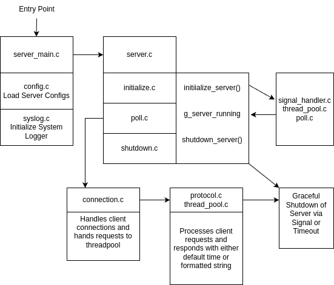

# Exec Summary
We are creating a daytime protocol server. A client can connect and request the time. An additional feature is that the client can optionally request the time in a certain formatted supported with strftime() function. 
# Design (Initial)

# Design (Final) / Control Flow

# Priorities of Work
1. Build Base Server with configurations and initialization to get ready for protocol implementation.
2. Research the strftime() function to see all the different formats that can be requested by the client.
3. Implement the protocol and test the function of requesting time out to make sure no logical or functional errors are present.
4. Code cleanup and BARR-C compliance
5. Valgrind and clang-tidy testing.
# Projected Challenges
1. Implementing the protocol to handle main functionality and edge cases.
2. Making sure to handle the requirements specified and not try to add more than needed functionality.
3. The custom functionality of requesting a format will probably be difficult to initially figure out.